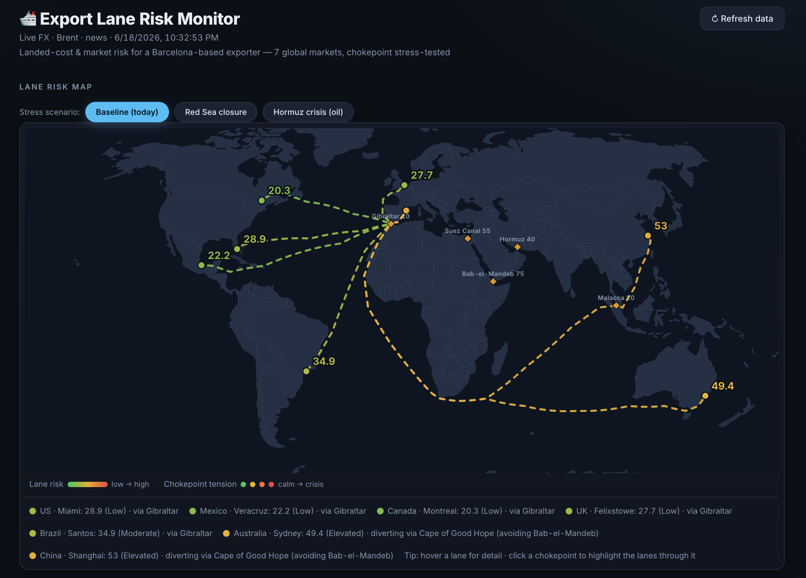

# 🛳️ Trade Lane Monitor

**Cost-to-serve & market-risk monitor for an exporter shipping out of Barcelona** to its seven existing markets — **US, Mexico, Canada, UK, Brazil, Australia and China**. It pulls live FX, oil and trade-news signals, estimates the all-in EUR **cost to land a container in each market**, tracks the **cost-to-serve spread** (for pricing / surcharge-timing / FX-hedging / inventory decisions — *not* a "which country to sell to" recommender), **backtests** the cost model, and **stress-tests** every lane against maritime-chokepoint disruptions (Red Sea, Hormuz).

> Modelled on a real-world use case: a **Spanish specialty-coatings exporter** shipping from Barcelona into seven global markets. Coatings are a useful example because they're **petroleum-derived** (so oil shocks hit both raw-material and freight cost) and ship as **regulated container cargo** — but the engine is industry-agnostic and retargets to any exporter via one line in `config.json`.

 <!-- TODO: drop a screenshot of the dashboard here -->

---

## What it does

For each of seven markets shipped from Barcelona (US · Miami, Mexico · Veracruz, Canada · Montreal, UK · Felixstowe, Brazil · Santos, Australia · Sydney, China · Shanghai):

- **Risk score (0–100)** blended from four signals
- **Estimated landed cost (€/container)** with a full breakdown
- A **cost-to-serve spread** across the existing lanes (a margin/pricing signal, not a market-selection call)
- A **backtest** validating the cost model on the same basis as the live cards
- A **stress-test** against chokepoint disruptions (Red Sea, Hormuz)
- A **daily text briefing** summarising it in plain English
- A **world map** with the seven lanes drawn through real maritime chokepoints (rerouting around the Cape when the Red Sea is disrupted), each chokepoint coloured by live tension

## The risk model

| Signal | Weight | How it's scored |
|---|---|---|
| FX volatility (EUR vs market currency) | 30% | 30-day realized volatility, **z-scored against its own history**, mapped to 0–100 via a sigmoid. *Lane-specific.* |
| Fuel cost | 20% | Brent crude z-scored vs its **90-day average**. Oil is the real, live bunker driver — but a *global* price, so this sub-score is the same for every lane by design (a small weight for that reason). |
| News sentiment | 20% | Transparent **word-boundary keyword lexicon** (in `config.json`), `pos − neg` per headline. *Lane-specific.* |
| Chokepoint exposure | 30% | **Noisy-OR** over the chokepoints on the lane's corridor — `1 − ∏(1 − tensionᵢ/100)`, i.e. the probability at least one is disrupted. Monotonic, so adding a chokepoint never lowers exposure. *Lane-specific.* |

Three of the four signals are lane-specific, so they drive the ranking; fuel is a deliberately small, honestly-global term. **There is no dry-bulk freight index in the risk model** — see the note below.

**Why z-scores, not fixed thresholds?** MXN is naturally more volatile than CAD. A fixed "high volatility" threshold would flag Mexico every day and tell you nothing. A z-score asks *"is this lane unusual relative to its own normal?"* — the question a risk analyst actually cares about. It also makes "cost vs 90-day average" literal: that average *is* the baseline.

## The landed-cost model (the "money" layer)

A transparent EUR estimate per container, per market:

```
goods value + container freight (lane-specific configured estimate)
            + bunker surcharge  (scales with live Brent)
            + duty/tariff        (goods value × market tariff rate)
            + feedstock surcharge (rises with Hormuz tension)
            + Cape reroute       (when the corridor is disrupted)
            + handling/docs/insurance
            = total landed cost
```

The **tariff term** is where trade policy becomes real money: the **real, live** US Section 122 10% tariff (eff. 24 Feb 2026, expires ~24 Jul 2026; under legal challenge) adds **€4,000** to a €40k container, while Canada (CETA) and Mexico (EU–Mexico agreement) land near zero.

### Why not BDRY / a dry-bulk index?

An earlier version used **BDRY** (the Breakwave Dry Bulk Shipping ETF) as the freight signal — that was **wrong**: BDRY tracks *dry-bulk* freight (iron ore, coal, grain in bulk carriers), whereas coatings ship in **containers**. The correct instrument is a container index (**Drewry WCI, Freightos FBX, SCFI**), none of which is freely available via API. So container freight is modelled as **lane-specific configured estimates** in `config.json` (transatlantic ≠ transpacific ≠ Asia-Europe), and the live cost driver we *do* fetch is **Brent crude**, the real bunker-fuel input. Figures are directional estimates, not freight quotes.

## A note on rules of origin (read this — it's the point)

A naïve version of this tool would suggest *routing goods through Canada to dodge the US tariff*. **That doesn't work.** US tariffs apply by **country of origin**, not port of entry — Spanish-origin goods are taxed as Spanish goods whether they sail to Miami directly or transit Montreal. Rules of origin (CETA, USMCA) exist specifically to prevent that trans-shipment arbitrage.

So this tool does **not** pick which country to sell to (the exporter already sells into all of them). It is a **cost-to-serve & margin monitor** across the existing lanes — for pricing, surcharge timing, FX hedging and inventory pre-positioning.

## Difficult-climate stress test

The map's chokepoints aren't decoration — they carry a live **tension** (0–100) reflecting the real climate (Red Sea high, Hormuz tense). A lane is **exposed** (risk) to the chokepoints on its corridor; when a corridor chokepoint's tension crosses the reroute threshold the lane **diverts around the Cape of Good Hope** — the map redraws the Cape route, the legend says *"diverting"*, and a **reroute premium** is added to cost. Risk-exposure (a 0–100 score) and the reroute cost (euros) are **two different outputs of the same disruption, not a double-count**.

**Hormuz is special**: no lane transits it, but it's oil-linked, so its tension raises fuel *and* feedstock cost on **every** lane (coatings are petroleum-derived — a Gulf disruption hits your input cost through the global oil channel).

The **scenario selector** recomputes everything live:

- **Red Sea closure** → Australia & China exposure and reroute cost climb further; Atlantic lanes untouched.
- **Hormuz crisis (oil)** → cost rises on *all seven* lanes via the feedstock/fuel channel.

## Validation / backtest

`backtest.py` replays the market history in the SQLite store and reconstructs the landed cost per lane for each past day — **on the same basis as the live cards** (baseline chokepoint tensions, so feedstock + reroute premiums are in both; this is why today's live number sits *inside* the reconstructed range rather than above it). It reports:

- **How often each lane had the lowest cost-to-serve**, and **why the call holds**: the winner's whole cost range sits below the runner-up's (disjoint ranges → below it on *every* day), which is the right evidence — the US tariff explains why the *US* is expensive, not why the winner beats #2.
- **The FX-margin tradeoff**: the leanest lane to *ship* is often *not* the one with the best FX-margin trend — a genuine tension the tool surfaces.

It validates the **cost model** (fully reconstructable from history). News sentiment and the blended risk score accrue forward from the first run — `storage.py` persists them daily so a real history builds up.

## Architecture

```
data_sources.py ─> risk_model.py ─> storage.py (SQLite)
   (fetch)          (score)          landed_cost.py (€ model)
                        │             chokepoints.py (stress engine)
                        ├──> backtest.py
                        ├──> briefing.py
                        │
                        └─> app.py + templates/index.html
                            (dark dashboard: stress-test map, cards, recommendation,
                             backtest panel, trend charts, briefing)
```

Every external source is **key-optional with a free fallback**, so the project runs out-of-the-box with zero configuration.

## Setup

```bash
python3 -m venv venv
source venv/bin/activate          # Windows: venv\Scripts\activate
pip install -r requirements.txt

cp .env.example .env              # optional — app runs with no keys
python app.py                     # then open http://127.0.0.1:5000
```

### Run the pieces individually

```bash
python data_sources.py   # smoke-test the live data layer
python risk_model.py     # print scores + write a snapshot
python landed_cost.py    # (imported) the € cost model
python backtest.py       # print the validation report
python briefing.py       # print the daily briefing
python -m unittest -v    # run the unit tests (no network)
```

### Branding toggle

In `config.json`, set `branding.mode` (e.g. `"generic"` or `"coatings"`, or add your own profile). The title, subtitle and cargo wording flip across the whole UI — same engine, no code change.

### Deploy (clickable URL)

The repo is deploy-ready for **Render** (free tier): `render.yaml` + `Procfile` use `gunicorn`. Push to GitHub, then **Render → New → Blueprint → select the repo**. (SQLite lives on ephemeral storage and re-backfills on each deploy — fine for a demo.)

## Configuration

All weights, windows, risk bands, the news lexicon, landed-cost parameters and branding live in **`config.json`** — tune without touching code.

## Limitations (deliberately stated)

- **Landed cost is a directional estimate** from configurable placeholders, not a freight quote.
- **Container freight is a configured estimate per lane** — a real container index (Drewry WCI / Freightos FBX) is the right instrument but isn't freely available via API.
- **Fuel cost (Brent) is global**, so that one sub-score doesn't differentiate the lanes; the ranking is driven by the three lane-specific signals (FX, news, chokepoint exposure) plus the lane-specific freight estimates.
- **News sentiment is a keyword lexicon**, not an ML model — chosen for auditability over sophistication.
- **Chokepoint tensions are configured estimates** of the current climate (scenario overrides are hypothetical), not a live geopolitical feed — auditable and tunable in `config.json`.
- **Scores are illustrative, not investment or trade advice.**

## Tech

Python · Flask · gunicorn · SQLite (stdlib) · D3 + TopoJSON (map) · Chart.js (trends). Live data: frankfurter.app (FX), Yahoo Finance (Brent crude), Google News RSS — with optional EIA / NewsAPI keys.

## License

_(TODO — pick a license, e.g. MIT.)_
